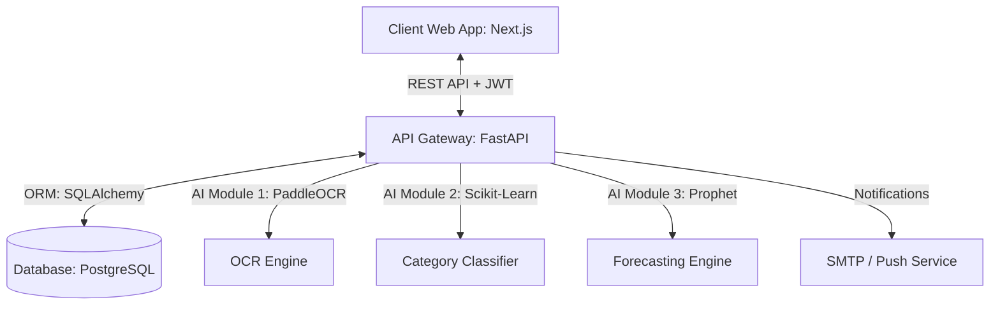

# Personal Finance Management (PFM) - Project Implementation Plan & Task Division

This document outlines the architecture, database schema, project folder structure, and a structured breakdown of tasks for your team to implement the Personal Finance Management platform.

---

## 1. System Architecture Overview

The system consists of three main components:
1. **Frontend (Next.js 14+)**: A modern, interactive web dashboard using TailwindCSS, Radix UI (via Shadcn), and Recharts for premium financial charts.
2. **Backend (FastAPI)**: A high-performance Python backend serving REST APIs, handling authentication (JWT), and hosting AI services (OCR, classification, forecasting).
3. **Database (PostgreSQL)**: A robust relational database to store users, accounts, transactions, budget limits, OCR history, and ML forecast outputs.



---

## 2. Directory Structure Layout

To keep the codebase organized and make it easy for teammates to work in parallel, we use a mono-repo structure:

```text
personal-finance/
├── backend/                   # FastAPI Backend
│   ├── app/
│   │   ├── api/               # API Router endpoints
│   │   │   ├── auth.py        # Authentication & Registration
│   │   │   ├── transactions.py# Transaction CRUD
│   │   │   ├── budgets.py     # Budget and Alerts
│   │   │   ├── ocr.py         # Bill Upload & OCR processing
│   │   │   └── forecast.py    # Spend Forecasting
│   │   ├── core/              # Security, Config, Database connection
│   │   │   ├── config.py
│   │   │   ├── database.py
│   │   │   └── security.py
│   │   ├── models/            # SQLAlchemy ORM Database models
│   │   ├── schemas/           # Pydantic validation schemas
│   │   └── services/          # Business logic and AI services
│   │       ├── ai_ocr.py      # PaddleOCR pipeline
│   │       ├── ai_classify.py # Transaction category predictor
│   │       └── ai_forecast.py # Prophet time-series model
│   ├── requirements.txt       # Dependencies
│   └── main.py                # FastAPI entry point
│
├── frontend/                  # Next.js Frontend
│   ├── src/
│   │   ├── app/               # Next.js App Router (Pages, Layouts)
│   │   │   ├── layout.tsx
│   │   │   ├── page.tsx       # Landing Page
│   │   │   ├── login/         # Auth pages
│   │   │   ├── register/
│   │   │   └── dashboard/     # Core dashboard page
│   │   ├── components/        # Reusable Tailwind + Shadcn components
│   │   │   ├── ui/            # Buttons, Inputs, Cards
│   │   │   ├── charts/        # Recharts wrappers
│   │   │   ├── transaction/   # Form, List, Upload components
│   │   │   └── layout/        # Sidebar, Header, User Profile
│   │   └── lib/               # API clients, helpers, utils
│   ├── package.json
│   └── tailwind.config.js
│
├── docker-compose.yml         # Run PostgreSQL & Redis in 1 click
└── README.md                  # Team execution manual
```

---

## 3. Database Schema Design (PostgreSQL)

```mermaid
erDiagram
    USERS {
        uuid id PK
        string email UK
        string hashed_password
        string full_name
        boolean is_active
        datetime created_at
    }
    TRANSACTIONS {
        uuid id PK
        uuid user_id FK
        double amount
        string type "income / expense"
        string category
        string description
        date transaction_date
        string merchant_name
        uuid ocr_log_id FK
        datetime created_at
    }
    BUDGETS {
        uuid id PK
        uuid user_id FK
        string category
        double limit_amount
        double spent_amount
        string period "monthly / weekly"
        datetime created_at
    }
    OCR_LOGS {
        uuid id PK
        uuid user_id FK
        string image_url
        string extracted_raw_text
        boolean status "success / failed"
        datetime created_at
    }
    FORECASTS {
        uuid id PK
        uuid user_id FK
        date forecast_date
        double predicted_amount
        string category
        datetime created_at
    }

    USERS ||--o{ TRANSACTIONS : owns
    USERS ||--o{ BUDGETS : defines
    USERS ||--o{ OCR_LOGS : uploads
    USERS ||--o{ FORECASTS : views
    OCR_LOGS ||--o[ TRANSACTIONS : generates
```

---

## 4. Teammates Task Division (Roadmap)

To successfully deliver this project with your team, you can divide tasks into **4 Core Tracks**. Each teammate can own one track:

### Track 1: Database Setup & FastAPI Back-End Infrastructure (Core Developer)
*   **Goal**: Set up the database, complete User Auth (JWT), CRUD for transactions, and budget management.
*   **Tasks**:
    1. Configure `docker-compose.yml` for PostgreSQL.
    2. Write SQLAlchemy Models and Alembic migrations.
    3. Implement JWT-based signup, login, password reset (OTP stub).
    4. Implement APIs: `/api/transactions` (CRUD), `/api/budgets` (CRUD, threshold checker).
    5. Write unit tests for APIs using pytest.

### Track 2: Premium Next.js UI & Dashboard Frontend (Frontend Developer)
*   **Goal**: Build a highly polished, responsive Next.js application with charts, tables, and forms.
*   **Tasks**:
    1. Setup Next.js, TailwindCSS, and basic folder layouts.
    2. Design premium landing page, login & registration pages.
    3. Build the primary dashboard sidebar, header, and card widgets (Net Worth, Income, Expenses, Alert widgets).
    4. Build interactive financial analytics with **Recharts** (Pie Chart for category distribution, Line Chart for spending trend, Bar Chart for monthly comparison).
    5. Build forms for manually adding transactions, transaction lists, and budget trackers.

### Track 3: OCR Bill Extraction Service (AI/ML Developer A)
*   **Goal**: Build a robust service using **PaddleOCR** to extract total amount, merchant, and date from uploaded bill images.
*   **Tasks**:
    1. Setup OCR backend environment (install PaddleOCR, OpenCV).
    2. Build an image processing pipeline (grayscale, thresholding, deskewing) to clean Vietnamese receipts.
    3. Implement regex/keyword heuristics to extract: `merchant_name`, `total_amount`, and `transaction_date`.
    4. Integrate `/api/ocr/upload` API in FastAPI to receive images, save OCR logs, and return structured JSON.
    5. Support custom overrides in the frontend in case the OCR returns slight errors.

### Track 4: Spend Classification & Forecasting Service (AI/ML Developer B)
*   **Goal**: Deploy a text classifier (Scikit-Learn) to automatically assign categories, and a time-series forecaster (Prophet) to predict next month's spending.
*   **Tasks**:
    1. Gather/generate a Vietnamese transaction description dataset (e.g., "mua bim bim" -> Food, "do xang" -> Travel).
    2. Train a **Logistic Regression** or **Naive Bayes** model using TF-IDF feature extraction, save the weights as a `.pkl` file.
    3. Load the model in FastAPI to auto-assign categories when transactions are added.
    4. Process historical transaction data and feed it into **Facebook Prophet** to forecast the user's spending trends for the next 7 and 30 days.
    5. Expose `/api/forecast` and `/api/classify` endpoints.

---

## 5. Next Steps for Core Implementation

To give the team a functional starting point, I will now:
1. Initialize the FastAPI backend structure.
2. Initialize the Next.js frontend with TailwindCSS, shadcn, and recharts.
3. Configure `docker-compose.yml` for local PostgreSQL setup.
4. Implement the core models and stub out AI pipelines so teammates have a structured code outline to work on.
